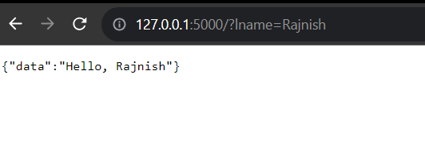
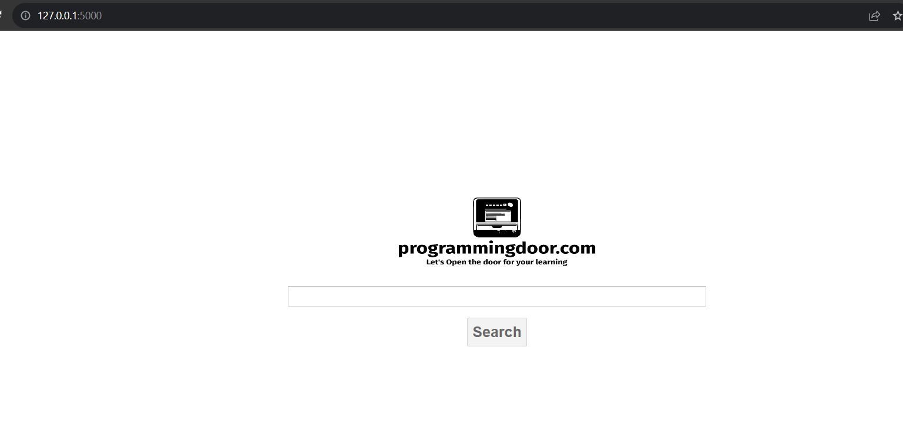
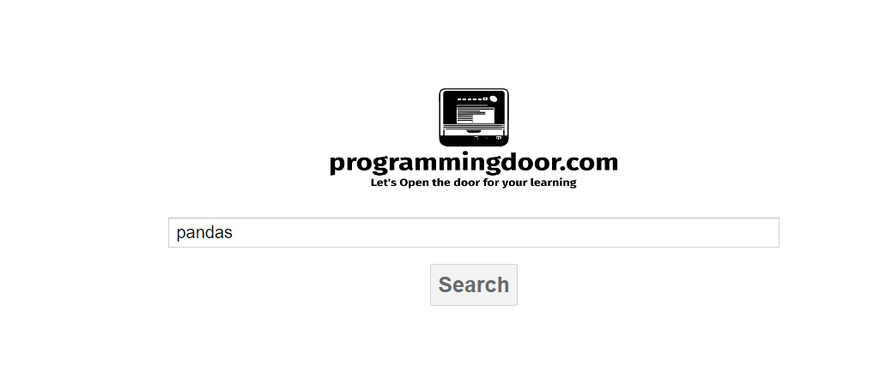

# This repoository contains the example of FastAPI
> 1. FirstAPI
> ## Testing first API

> 2. programmingdoor.com search API (similar to google.com)
> ## Home Page

> ## Type the keyword and and press enter

> ## Next Page (output)

## create virtual env
> python -m venv env

## Activate the virtual env
> .\env\Scripts\activate

## install modules using requirement.txt
> pip install -r .\requirements.txt
	
	
## Run Flask API
> flask run

## run the API using command prompt
> curl http://127.0.0.1:5000

**or**

> curl -i -X GET http://localhost:5000/

## to create gitignore file which you dont want to push to the github
> touch .getignore

## URL - Uniform Resource Locator
> it contains
1. Protocol - Typically http or https
2. Domain Name - programmingdoor.com
3. File Name - index.html
4. QueryString - ?name=Rajnish

## Flask Project Structure
    ProjectName/
        templates/
            index.html
        static/
            style.css
        app.py